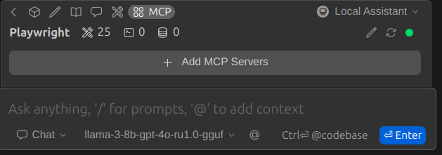

# How to add personal assistant to VS_CODE (USING MCP SERVER)

## Personal Assistant

 

* Add [CONTINUE](https://www.continue.dev/) extension to visual code
* Either remote MCP server or locally owned MCP server to be added in `mcpServers` folder
* I have added <u>PLAYWRIGHT</u> MCP server, I found from <b>HUGGING-FACE</b>
* Add models - I downloaded `Meta-Llama-3.1-8B-Instruct-GGUF` model using <b>LM Studio</b> and provided the configuration (Approx <b>5gb</b> download space required for the model )
* Locally start your LM Server which will open connections on `http://localhost:1234`
* Open your co-pilot and you'll be able to see the models as well as your MCP tools

* As shown below, your VS-CODE co-pilot can now use custom MCP Servers & act as personal assistant

 

